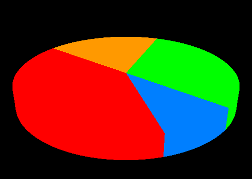

# Pie Chart

This OpenGL-based pie chart visualization is designed to provide an interactive and dynamic graphical repesentatio of data with support of functionality using the GLUT (OpenGL Utility Toolkit) framwork.

# Pie Chart Features
- Rotate the pie chart in real-time.
- Enhanced viewing angles and better understanding of data propertions
- Input handling and rendering loop integration.
- Intuitive dimension to the chart, make it ideal for ui, dashboard and data presentation.

# Pie Chart Functions
**`void pie_slice_draw(float startAngle, float sweepAngle, float height, float r, float g, float b);`**  
**`void pie_chart_disp();`**  
**`void pie_chart_reshape(int w, int h);`**  
**`void pie_chart_idle();`**  
**`void pie_chart_init();`**
